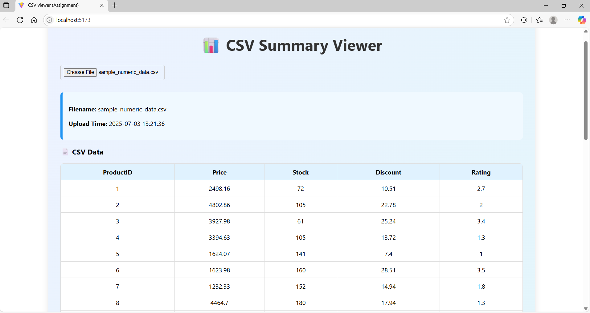
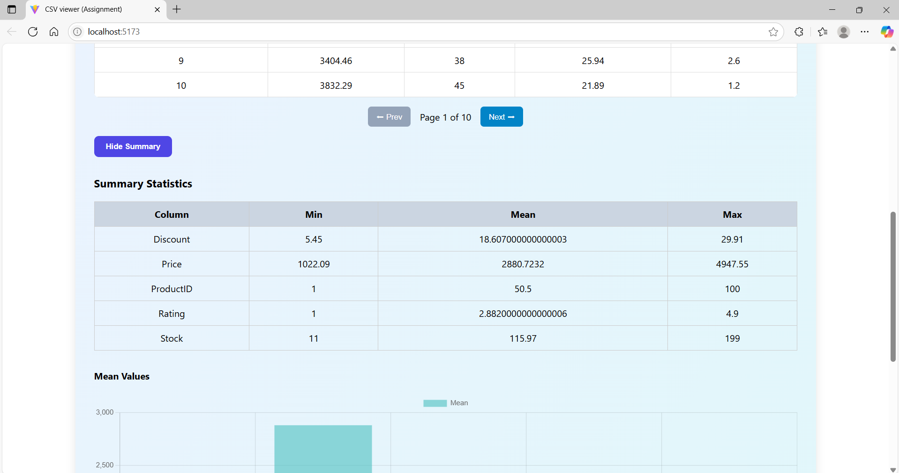
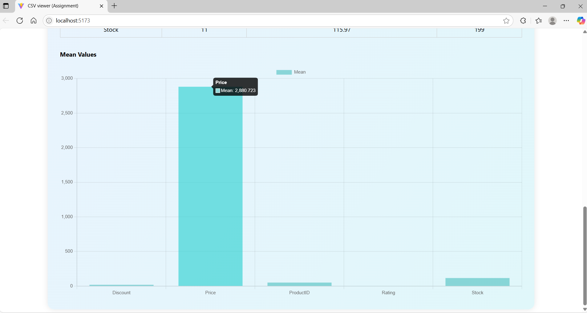

# 📊 CSV Summary Viewer

A simple full-stack web application that allows users to upload a CSV file, preview the data in a paginated table, and view basic summary statistics for each numeric column — all wrapped in an attractive modern UI.

---

## 🚀 Features

✅ Upload CSV files  
✅ Display tabular data (paginated: 10 rows per page)  
✅ View summary statistics (min, mean, max) for numeric columns  
✅ Toggle summary view with a button  
✅ Visualize mean values in a bar chart  
✅ Responsive and clean design

---

## 🛠 Tech Stack

### Frontend
- React.js (with hooks)
- Axios
- Chart.js (`react-chartjs-2`)
- Custom CSS styling

### Backend
- Python Flask
- pandas
- flask-cors

---


---

## ⚙️ Getting Started

Follow these steps to run the project on your local machine.

---

### 1️⃣ Clone the Repository

```bash
git clone https://github.com/SachinNawale2063/CSV_viewer_app.git
cd CSV_viewer_app
```
### 2️⃣ Backend Setup (Flask)
```bash
cd backend
python -m venv venv

# On Windows:
venv\Scripts\activate

# On Mac/Linux:
# source venv/bin/activate

pip install -r requirements.txt

python app.py
```
Flask will start on : http://localhost:5000/


### 3️⃣ Frontend Setup (React)

```bash
cd frontend
npm install
npm run dev
```
React will run on : http://localhost:5173/

## 📄 Sample CSV Files
[sample_employees.csv](sample_employees.csv)

[sample_numeric_data.csv](sample_numeric_data.csv)

## 📷 Screenshots







## 🙏 Thank You

Thank you for checking out this project!
If you found it helpful or interesting, consider giving it a ⭐ on GitHub and sharing it with others. Your support means a lot!


     
